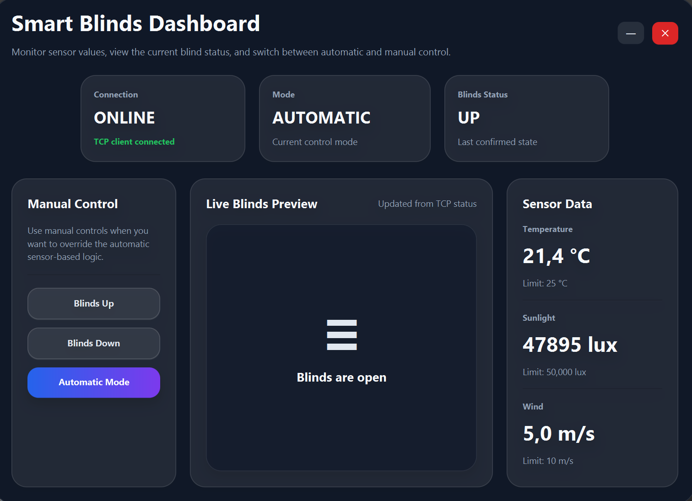
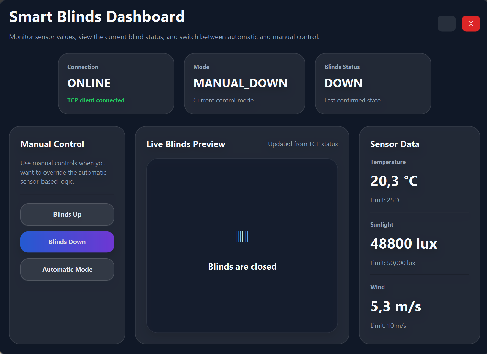
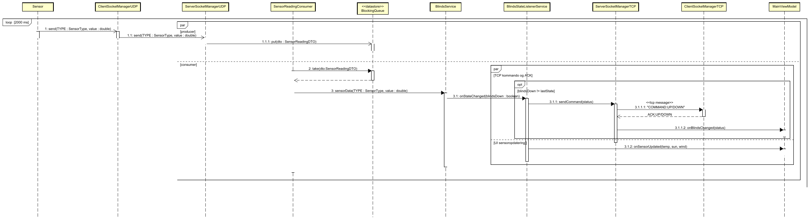

### This project was completed on second semester

# Simple Automatic Outside Blinds Server-Client System


Outdoor blinds, also known as external shades, help reduce indoor heat by
blocking sunlight before it reaches the windows. This improves comfort and can
lower energy consumption for cooling.

To operate efficiently, such systems need to function automatically based on
environmental conditions. This requires input from sensors measuring factors
such as temperature, sunlight intensity, and wind speed.

This project demonstrates a simple server-client system based on a distributed
architecture, where sensor data is transmitted via UDP to a central server. The
system uses a layered design with a producer–consumer pattern to decouple data
reception from processing, improving scalability and separation of concerns.

The server processes incoming data using a decision-making algorithm located in
the service layer and controls the blinds accordingly. This ensures optimal
comfort while maintaining safety, for example by retracting the blinds during
strong wind conditions. The system communicates commands to clients via TCP,
enabling real-time updates and control.

In addition, the system supports manual override, allowing user interaction as
long as it does not compromise the safety or longevity of the blinds.

Further technical details and architectural decisions are discussed in depth in
the remainder of this report.

<!-- Extended project README section -->

---

# Outside Blinds - Project Documentation

Outside Blinds is a Java and JavaFX application that demonstrates a distributed server-client system for automatic outdoor blinds. The system receives simulated sensor data, evaluates the current environment and decides whether the blinds should be raised or lowered.

The project combines networking, a graphical user interface, automated decision logic and tests. UDP is used for sensor data, while TCP is used for sending blind control commands to connected clients.

## Features

The application includes functionality for:

- receiving temperature, sunlight and wind sensor data
- processing sensor input through a central service layer
- automatically lowering the blinds when temperature and sunlight are high
- keeping the blinds raised when wind is too strong
- supporting manual up and manual down control
- preventing unsafe manual lowering during strong wind
- sending blind state updates to clients through TCP
- showing the current blind state in a JavaFX dashboard
- simulating sensor input for local testing
- testing both service logic and full UDP/TCP communication flow

## Technologies

The project uses:

- Java
- JavaFX
- FXML
- CSS
- UDP sockets
- TCP sockets
- Producer-consumer pattern with a blocking queue
- JUnit 5
- IntelliJ IDEA project structure

## Project Structure

```text
NEC-Exam---Outside-Blinds/
|-- src/
|   |-- RunApp.java                  # Main JavaFX application startup
|   |-- MainServerUDP.java           # UDP server entry point
|   |-- MainClientUDP.java           # UDP client entry point
|   |-- MainServerTCP.java           # TCP server entry point
|   |-- MainClientTCP.java           # TCP client entry point
|   |-- server/                      # TCP/UDP server managers and sensor consumer
|   |-- client/                      # TCP/UDP clients and blind client logic
|   |-- service/                     # Blind decision logic
|   |-- simulator/                   # Sensor simulators
|   |-- model/                       # DTOs, enums and domain state
|   |-- presentation/                # JavaFX controller and view model
|   |-- shared/                      # Listeners and logging utilities
|   `-- test/                        # Unit and integration tests
|-- resources/
|   |-- fxml/                        # JavaFX views
|   `-- css/                         # Styling for the dashboard
|-- docs/
|   `-- screenshots/                 # Application screenshots
|-- bilag/                           # Class and sequence diagrams
|-- out/                             # Compiled output
|-- NEC Exam.iml
`-- README.md
```

## Architecture

The system is built around a distributed flow between simulated sensors, a central server/service layer and connected blind clients.

### Sensor Flow

Sensor simulators send measurements such as temperature, sunlight and wind speed to the UDP server. The UDP server receives the data and places it in a queue. A `SensorReadingConsumer` reads from the queue and passes the readings to `BlindsService`.

### Service Layer

`BlindsService` contains the main decision logic. It evaluates whether:

- temperature is above the configured limit
- sunlight is above the configured limit
- wind is below the safety limit
- the blinds are in automatic or manual mode

In automatic mode, the blinds are lowered only when it is both hot and sunny, and wind conditions are safe. Strong wind forces the system back into automatic mode and prevents the blinds from being lowered manually.

### TCP Client Updates

When the blind state changes, listeners notify the TCP server. The TCP server sends updated commands to connected clients, so the UI and blind client can react to changes in real time.

### Presentation Layer

The JavaFX presentation layer consists of FXML views, a controller and `MainViewModel`. The dashboard displays sensor/blind state and allows manual interaction through the UI.

## Screenshots





## Diagrams

### Class Diagram


### Sensor Data Sequence Diagram



### Manual Control Sequence Diagram


## Testing

The project includes both unit tests and integration tests under `src/test`.

Test coverage includes:

- automatic blind lowering when temperature and sunlight are high
- keeping blinds raised when temperature or sunlight is too low
- keeping blinds raised during strong wind
- manual up and manual down behavior
- protection against unsafe manual lowering
- full UDP-to-service-to-TCP flow
- invalid UDP message handling

Important test files include:

- `src/test/unit/service/BlindsServiceTest.java`
- `src/test/integration/FullFlowTest.java`

## How to Run the Project

The project is set up as an IntelliJ IDEA Java project.

1. Open the `NEC-Exam---Outside-Blinds` folder in IntelliJ IDEA.
2. Make sure JavaFX is configured for the project.
3. Run the main application class:

```text
src/RunApp.java
```

`RunApp` starts the JavaFX dashboard, creates the service layer, starts UDP and TCP communication, starts the sensor simulator and connects a blinds client.

The project also contains separate entry points for testing individual network parts:

```text
src/MainServerUDP.java
src/MainClientUDP.java
src/MainServerTCP.java
src/MainClientTCP.java
```

## Documentation

Additional diagrams and appendix material are located in:

```text
bilag/
```

Screenshots used in this README are located in:

```text
docs/screenshots/
```

## Notes

- The application demonstrates a simple distributed architecture with both UDP and TCP communication.
- UDP is used for incoming sensor data.
- TCP is used for reliable blind state commands to clients.
- The service layer protects the blinds by prioritizing wind safety over manual control.
- The project was made for a NEC exam project and focuses on networking, communication flow and layered design.


